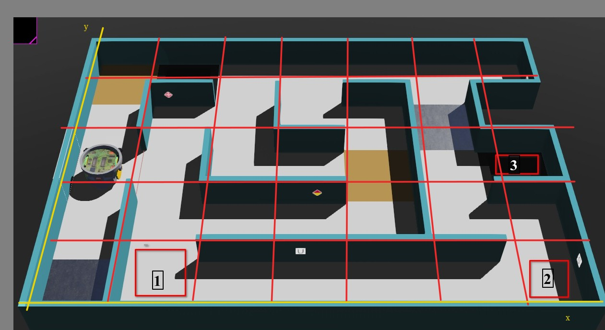

# Ejercicio 1
Hacer que el robot siga el recorrido indicado en la siguiente imagen.

# Tips:
Ver los siguientes ejemplos:

* [GPS](../../../Examples/Gps/uso_gps.py)
* [Rotacion](../../../Examples/Rotacion/rotation_usando_giroscopo.py)
