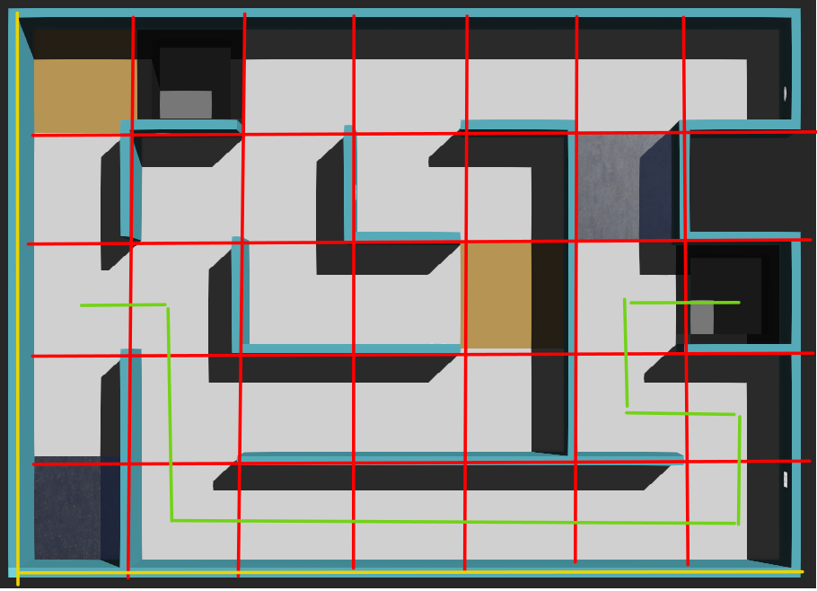

# Ejercicio 2
Representar en una grilla el recorrido del robot realizado en el ejercicio 1.
Ej.
```python
Grilla = [[ 0 0 0 0 0 0 0 0 0 ]
          [ 0 0 0 0 0 0 0 0 0 ]
          [ 0 0 0 0 0 0 0 1 1 ]
          [ 1 1 0 0 0 0 0 1 0 ]
          [ 0 1 0 0 0 0 0 1 1 ]
          [ 0 1 0 0 0 0 0 0 1 ]
          [ 0 1 1 1 1 1 1 1 1 ]]
```


# Tips:
Utilizar numpy

```python
import numpy

# Crear una matriz de 10 x 10 rellena de 0
grilla = numpy.zeros((10,10))
print(grilla)
# Guardar 1 en la posicion [5,5] de la grilla
grilla[5,5] = 1
print(grilla)
```

# Problemas a tener en cuenta:

1. Cual es el tamaño de la casilla?
2. Cual es la posicion inicial del robot en el mapa
   1. Grilla (Matriz) del GPS
   2. Grilla de nuestro mapa
   3. Tener el cuenta el offset y la relacion entre el GPS y la grilla del mapa
   4. Los index de la grilla de nuestro mapa no pueden ser negativos.
      Ej. grilla[x,y]: x>0 & y>0 ; (x,y) son numeros enteros
      Tips:
        grilla[x+offset_x, y+offset_y] = 1
3. Representar la casilla en la grilla
