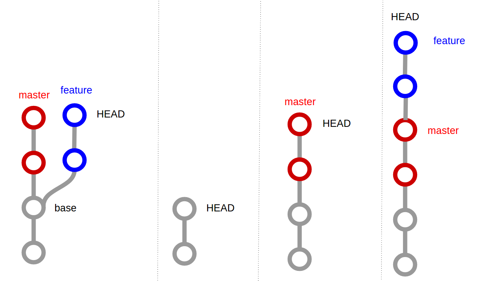

# Comandos basicos de git

* git add [files../folder]
* git branch
* git branch -D ["nombre de la branch"]
* git checkout ["branch"]
* git checkout -b ["nombre de la branch"]
* git clone [url]
* git commit -m "Titulo de la descripcion del commit"
* git diff
* git pull
* git push origin ["nombre de la branch"] -u
* git status

# Ejemplo de un merge

# Resumen de los comandos mas utilizados en git

[Commandos de git](github-git-cheat-sheet.pdf "Commandos de git")

